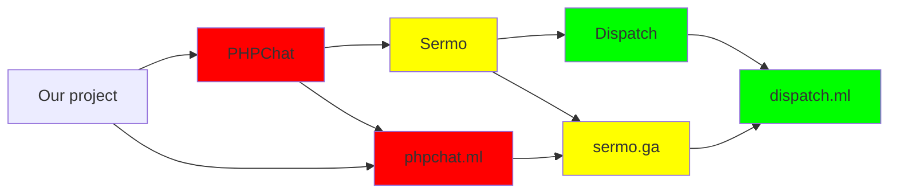

## Dispatch
### Why
- Talking is cool.
- But talking securely is cooler.
- So Dispatch lets you and your friends talk, securely!
- We took our shared skills and made a nice-looking, yet also functioning chat service.
- The code is available here for transparency (but not the passwords!)
### What
- Public chat
- Private chat
- Forums
- Profiles
- User lookup
- Admin features
### How

### Mission Statement
Our mission is to make quality software that serves people. We don't steal your data. We use free services, and you never pay for anything. We don't use ads, and don't sell your data. You may think that WhatsApp is secure, but in the current day and age it is not, unfortunately. The internet today is controlled by bige tech companies. Lets change that, one small step at a time.
Copyright Policy
We don't like copyrighting things, but we think that our property deserves to be ours.

Dispatch's software is licensed under the GNU General Public License v3.0.
What is that?

The GNU General Public License v3.0 (often shortened to GNU-GPLv3 or even GPL) is a copyleft license made for software and other kinds of things. It outlines that:

    You have to credit the author (me) if you want to distribute this piece of software.

    You can adapt upon this piece of software.

    You must release your adaptation of this piece of software under the same license as this one.

#### Dispatch is licensed under the GNU-GPL license.

<!-- termtosvg is very cool! -->

Dispatch's Logos are licensed under CC BY-NC-ND 4.0
What is that?

This particular Creative Commons license says that:
- You have to credit the author (us) if you want to distribute these logos.
- You may not adapt upon these logos and release them.
- You cannot use these logos for commercial purposes.
- You are free to share this logo.
- If in doubt, contact us at [dispatch.ml@proton.me](mailto:dispatch.ml@proton.me)

### Contributors guide
- The code is a mess.
<pre>
██╗   ██╗ ██████╗ ██╗   ██╗    ██╗  ██╗ █████╗ ██╗   ██╗███████╗    ██████╗ ███████╗███████╗███╗   ██╗    ██╗    ██╗ █████╗ ██████╗ ███╗   ██╗███████╗██████╗ ██╗
╚██╗ ██╔╝██╔═══██╗██║   ██║    ██║  ██║██╔══██╗██║   ██║██╔════╝    ██╔══██╗██╔════╝██╔════╝████╗  ██║    ██║    ██║██╔══██╗██╔══██╗████╗  ██║██╔════╝██╔══██╗██║
 ╚████╔╝ ██║   ██║██║   ██║    ███████║███████║██║   ██║█████╗      ██████╔╝█████╗  █████╗  ██╔██╗ ██║    ██║ █╗ ██║███████║██████╔╝██╔██╗ ██║█████╗  ██║  ██║██║
  ╚██╔╝  ██║   ██║██║   ██║    ██╔══██║██╔══██║╚██╗ ██╔╝██╔══╝      ██╔══██╗██╔══╝  ██╔══╝  ██║╚██╗██║    ██║███╗██║██╔══██║██╔══██╗██║╚██╗██║██╔══╝  ██║  ██║╚═╝
   ██║   ╚██████╔╝╚██████╔╝    ██║  ██║██║  ██║ ╚████╔╝ ███████╗    ██████╔╝███████╗███████╗██║ ╚████║    ╚███╔███╔╝██║  ██║██║  ██║██║ ╚████║███████╗██████╔╝██╗
   ╚═╝    ╚═════╝  ╚═════╝     ╚═╝  ╚═╝╚═╝  ╚═╝  ╚═══╝  ╚══════╝    ╚═════╝ ╚══════╝╚══════╝╚═╝  ╚═══╝     ╚══╝╚══╝ ╚═╝  ╚═╝╚═╝  ╚═╝╚═╝  ╚═══╝╚══════╝╚═════╝ ╚═╝
                                                                                                                                                                 
</pre>
- You're still here, wow.
- So the first step is to clone this repo
- Then make your changes
- You then submit a PR
- Go through the approval process
- And then you are done
- If we like your code, we will add it to the server!
### Contributors and the history of Dispatch
- This project is actually already 6 months old at launch - we've been working on it since September 2022
- We estimate that the two main contributors @max and @werdl have collectively spent ~600 hours working on it

- You can find out more at various places on our website
#### List
- [@max](github.com/uimaxbai) - Frontend and some backend
-  [@werdl](github.com/werdl) - Backend and forums
-  [@teapot](github.com/thisiscoding1234) - Some random things
-  [@2010person](github.com/2010person) - Admin stuff
- [@froggo](no-github-yet) - logos (artist)